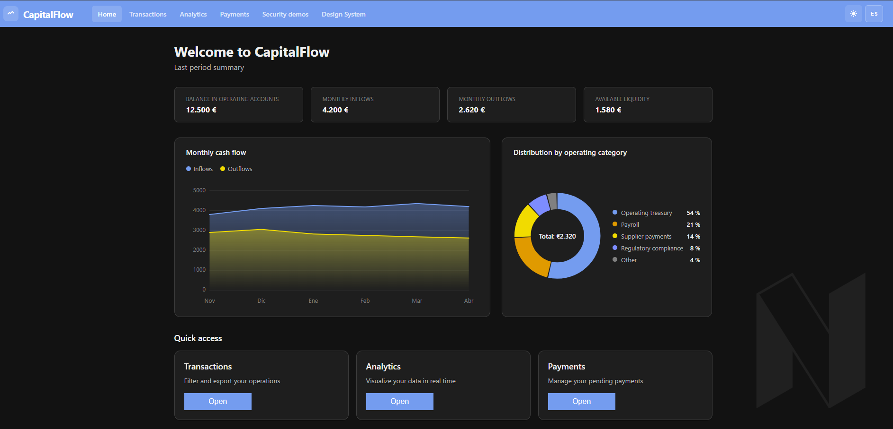
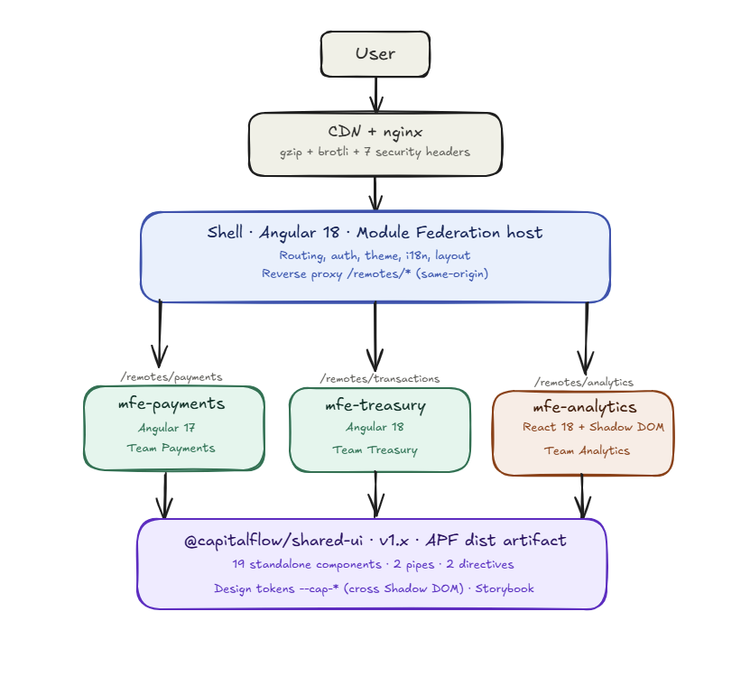
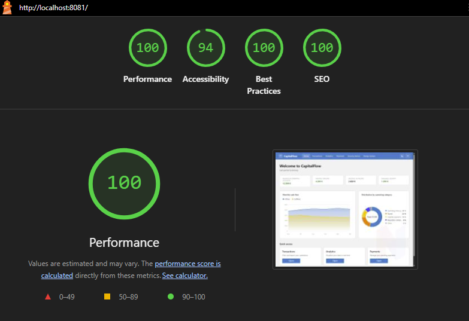
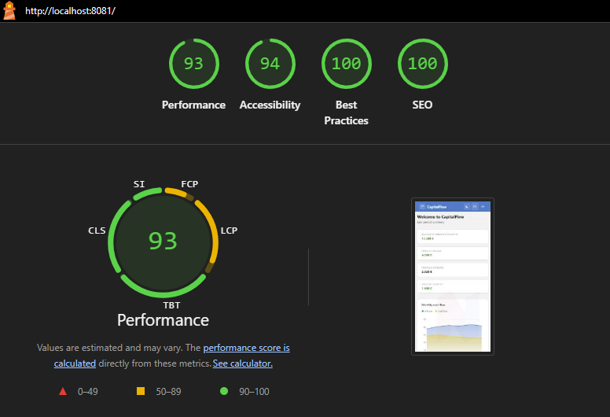

<p align="center">
  
</p>

<h1 align="center">CapitalFlow</h1>

<p align="center">
  
  
  
  
  
  
  
  
</p>

---

CapitalFlow is a practical Angular Expert evaluation project for a B2B financial
platform. The repository demonstrates an incremental migration from a fragile
front-end monolith to a micro-frontend architecture with shared UI, security
hardening, performance controls, automated tests, and Docker-based local
deployment.

## Documentation

📄 **[Read the full technical proposal (PDF)](docs/CapitalFlow_Propuesta_Tecnica_v9.pdf)** — 27-page architecture, security and migration plan covering the 5-phase roadmap, 11 audit findings, and supporting evidence.

## Architecture

<p align="center">
  
</p>

The shell loads three remote micro frontends through Webpack Module Federation:
`mfe-payments` (Angular 17), `mfe-transactions` (Angular 18, implements the
**Treasury team** domain from the briefing) and `mfe-analytics-react` (React 18
isolated through Custom Element + Shadow DOM). All four Angular surfaces consume
`@capitalflow/shared-ui` as a compiled `dist` artifact (Angular Package Format).

## Performance

Lighthouse against the production Docker build (`http://localhost:8081`, gzip on):

<p align="center">
  
  
</p>

| Profile | Performance | Accessibility | Best Practices | SEO |
| --- | --- | --- | --- | --- |
| Desktop | **100** | 94 | 100 | 100 |
| Mobile (Slow 4G) | **93** | 94 | 100 | 100 |

## Quick start (clone fresh)

`shared-ui` is consumed by the Angular projects as a `dist` artifact (path mapped
to `../shared-ui/dist`). On a fresh clone the dist does not exist yet, so run the
bootstrap script first to install dependencies and produce the artifact:

```powershell
# Windows
.\setup.ps1
.\start-local.ps1      # or: docker compose up -d --build
```

```bash
# Linux / Mac
./setup.sh
docker compose up -d --build
```

`setup.{ps1,sh}` installs every project's `node_modules` and builds
`shared-ui/dist`. The Linux/Mac flow targets Docker only; the PowerShell launcher
is the Windows convenience for running the dev servers natively.

## Current Stack

- Shell: Angular 18 standalone application, Module Federation host, OnPush, Signals.
- Transactions MFE: Angular 18 remote exposed as a Web Component (implements the
  **Treasury team** domain from the briefing — folder kept as `mfe-transactions/`
  for scaffolding reasons, rename to `mfe-treasury/` scheduled for Sprint 1).
- Payments MFE: Angular 17 remote exposed as a Web Component.
- Analytics MFE: React 18 remote exposed as a Web Component with Shadow DOM.
- Shared UI: `@capitalflow/shared-ui` v1.1.0, Angular component library.
- Integration: Webpack Module Federation via `@angular-architects/module-federation`.
- Styling: SCSS and CSS custom properties exposed as `--cap-*` design tokens.
- Testing: Karma/Jasmine for Angular projects, Jest for the React MFE.
- Runtime: nginx containers orchestrated by Docker Compose.

## Local Docker Stack

Build and start all services:

```bash
docker compose up -d --build
```

Stop the stack:

```bash
docker compose down
```

Service endpoints (Docker):

| Service | URL | Description |
| --- | --- | --- |
| shell | http://localhost:8081 | Angular 18 host application |
| mfe-analytics-react | http://localhost:8082 | React 18 analytics remote |
| mfe-payments | http://localhost:8083 | Angular 17 payments remote |
| mfe-transactions | http://localhost:8084 | Angular 18 transactions remote |
| storybook | http://localhost:6007 | Shared UI documentation |

## Local development without Docker

Each project can be run standalone with npm scripts. Run them in separate
terminals. The first time, run `.\setup.ps1` (Windows) or `./setup.sh`
(Linux/Mac) to install dependencies and produce `shared-ui/dist`, which the
Angular consumers depend on.

### Run all projects locally

One-command launcher (Windows PowerShell):

```powershell
.\start-local.ps1   # starts the 5 projects in separate windows, waits for readiness, opens browsers
.\stop-local.ps1    # kills the processes and frees ports 4200/4201/4202/4203/6006
```

Or run them manually in separate terminals:

| Project | Port | Command | URL |
| --- | --- | --- | --- |
| shell | 4200 | `cd shell && npm run start` | http://localhost:4200 |
| mfe-analytics-react | 4201 | `cd mfe-analytics-react && npm run start` | http://localhost:4201 |
| mfe-payments | 4202 | `cd mfe-payments && npm run start` | http://localhost:4202 |
| mfe-transactions | 4203 | `cd mfe-transactions && npm run start` | http://localhost:4203 |
| shared-ui Storybook | 6006 | `cd shared-ui && npm run storybook` | http://localhost:6006 |

> Ports differ between modes. Docker exposes 8081/8082/8083/8084/6007; native dev
> servers bind to 4200/4201/4202/4203/6006. The CI pipeline and the screenshots
> in `docs/img/` always use the Docker ports.

### Compatibility matrix: which services to run for what

| To validate | Services needed |
| --- | --- |
| Shell home, /admin/* security demos, /design-system | shell only |
| /transactions (Angular 18 MFE) | shell + mfe-transactions |
| /analytics (React MFE) | shell + mfe-analytics-react |
| /payments (Angular 17 MFE) | shell + mfe-payments |
| All MFE integration | all 4 |
| Component library docs | shared-ui Storybook only |

### Notes

- Module Federation hosts depend on the remote `remoteEntry.js` URL. If a remote MFE is not running, the wrapper component shows a `cap-alert` with a retry button.
- For full integration testing, prefer Docker: `docker compose up -d --build`.

## Tests

Run each project test suite independently:

```bash
cd shell
npm test

cd ../shared-ui
npm test

cd ../mfe-transactions
npm test

cd ../mfe-payments
npm test

cd ../mfe-analytics-react
npm test -- --runInBand
```

Latest verified local result:

| Project | Test runner | Count |
| --- | --- | --- |
| shell | Karma/Jasmine | 99 passing |
| shared-ui | Karma/Jasmine | 158 passing |
| mfe-transactions | Karma/Jasmine | 46 passing |
| mfe-payments | Karma/Jasmine | 26 passing |
| mfe-analytics-react | Jest | 26 passing |
| **Subtotal (unit)** | | **355 passing** |
| e2e | Playwright | 9 passing |
| **Total** | | **364 passing** |

The 9 Playwright specs cover smoke tests for the shell, each MFE, the
security demos area, plus functional specs: transactions filter,
XLSX export via Web Worker, the shell language toggle, and language
propagation into the payments and transactions MFEs.

## Monorepo Layout

```text
expert/
  shell/
    src/app/
      home/                     Dashboard (KPIs, donut + trend charts, quick links)
      admin/                    Security audit demos (WYSIWYG, PDF, uploads, comments)
      search-demo/              Reflected-search XSS remediation demo
      design-system/            Component catalogue page consumed from shared-ui dist
      analytics-wrapper/        React MFE host wrapper
      payments-wrapper/         Angular 17 MFE host wrapper
      transactions-wrapper/     Angular 18 MFE host wrapper
      core/                     Models and shared services
                                  (MfeWrapperBaseComponent, RemoteMfeLoaderService)
    Dockerfile
    nginx.conf
    webpack.config.js

  mfe-transactions/
    src/
      bootstrap.ts              Registers <mfe-transactions>
      app/
        transactions.component.*   Container with filters + grid
        components/                transactions-stats, transactions-table
        services/                  transactions, export, transactions-metrics
        models/                    transaction, transaction-status-kind, transactions
        utils/                     format-amount
        workers/                   XLSX export worker
    Dockerfile
    nginx.conf
    webpack.config.js
    webpack.test.config.js

  mfe-analytics-react/
    src/
      App.tsx
      web-component.tsx         Registers <mfe-analytics>
    Dockerfile
    nginx.conf
    webpack.config.js

  mfe-payments/
    src/
      bootstrap.ts              Registers <mfe-payments>
      app/
        payments.component.*    Container with reactive form + listing
        payments.constants.ts
        payments.types.ts
    Dockerfile
    nginx.conf
    webpack.config.js
    webpack.test.config.js

  shared-ui/
    src/
      lib/                      CapitalFlow component library (19 components)
      stories/                  Storybook stories
      testing/                  Shared test mocks
    .storybook/
    Dockerfile
    ng-package.json

  docker-compose.yml
  .gitlab-ci.yml
  README.md
```

## Security Demos

The shell exposes a security demo area at:

```text
http://localhost:8081/admin
```

The table below maps every vulnerability from the briefing's external audit
report to its concrete remediation in this repository:

| # | Vulnerability (briefing) | Mitigation | Status |
| --- | --- | --- | --- |
| 1 | XSS in transaction comments | Angular interpolation auto-escape; payloads render as literal text | Demo at `/admin/comments` |
| 2 | iframe without protocol validation (`javascript:`) | URL protocol + host allowlist | Demo at `/admin/reports` |
| 3 | Executable filenames on upload | `{{ }}` interpolation + MIME validation | Demo at `/admin/documents` |
| 4 | Reflected XSS in global search | `[innerText]` instead of `[innerHTML]` | Demo at `/search-demo` |
| 5 | WYSIWYG accepts `<script>` | DOMPurify on save (Quill + sanitiser pipe) | Demo at `/admin/templates` |
| 6 | No Content Security Policy | Strict CSP in `shell/nginx.conf` | Implemented |
| 7 | Cookies missing `HttpOnly` / `Secure` / `SameSite` | Backend cookie policy required | Sprint 1 backend |
| 8 | No HSTS | `Strict-Transport-Security: max-age=31536000` | Implemented |
| 9 | No `X-Frame-Options` / `X-Content-Type-Options` / `Referrer-Policy` | All three declared in nginx | Implemented |
| 10 | No `Permissions-Policy` | `camera=(), microphone=(), geolocation=()` | Implemented |
| 11 | No external SAST/DAST audit | `npm audit` + `gitleaks` + Trivy in CI | Sprint 2 |

**9 of 11 vulnerabilities are implemented and demonstrable live.** The remaining
two (HttpOnly cookies and SAST/DAST in CI) require backend coordination and are
scheduled for Sprints 1 and 2 respectively. The demos cover:

- Transaction comments rendered through Angular interpolation (auto-escape).
- WYSIWYG template sanitisation with Quill and DOMPurify.
- PDF report URL validation before iframe usage.
- Document filename rendering as text instead of executable HTML.
- Reflected search payload rendering through text binding.
- CSP and security headers in nginx for the shell.

## Shared UI Library

`shared-ui` contains the CapitalFlow Angular design-system implementation:
19 standalone components (button, alert, info-card, header, footer, modal,
input, tabs, tab, table, data-grid, status-badge, spinner, stat-card,
metric-card, tooltip, icon, donut-chart, trend-chart), 2 pipes (`iban`,
`safeHtml`), 2 directives (`appClickOutside`, `capCellTemplate`) and a
`DynamicCssService` helper.

Storybook is available at:

- `http://localhost:6007` when launched via Docker (`docker compose up`).
- `http://localhost:6006` when launched locally (`cd shared-ui && npm run storybook`).

### Library philosophy

The library adapts to the application, not the other way around. Operating
rules applied during component consolidation:

1. App component duplicated in the library → modify library to match the app
   visual identity, then replace the local copy.
2. Library component never used → integrate it where it fits without visual
   change, otherwise delete it.
3. App native HTML where the library has an equivalent → tune the library
   variant to match, then replace the native markup.
4. Custom app component without library equivalent → add it to the library
   only if it is genuinely reusable.

`cap-tooltip`, `cap-modal`, the `appClickOutside` directive and
`DynamicCssService` are kept as static dependencies of `cap-input`'s
standard variant. They are infrastructure for the rich form fields the
financial workflows require.

### Consumption as a `dist` artifact

Angular consumers (shell, mfe-payments, mfe-transactions) do **not** import the
library from source. Each `tsconfig.json` path-maps the package name to the
`ng-packagr` build output:

```json
{
  "paths": {
    "@capitalflow/shared-ui": ["../shared-ui/dist"]
  }
}
```

This forces consumers to go through the published Angular Package Format
bundle, which is the same artifact a future `npm publish` would ship. The
APF entry point is configured in `shared-ui/ng-package.json` as
`src/public-api.ts`.

Practical consequence: any change to `shared-ui` requires rebuilding its
`dist/` (`cd shared-ui && npm run build`) before the consumers pick it up.
The setup and CI scripts do this automatically; the `start-local.ps1` launcher
runs the build once before bringing the dev servers up.

### Worker isolation rule

The XLSX export worker lives inside `mfe-transactions`. When a project adds
web workers via Angular CLI, its `tsconfig.worker.json` compiles `*.worker.ts`
with `lib: ["ES2022", "webworker"]` (no DOM types). Workers must import their
types via direct file paths, not via index aggregators, otherwise the program
graph reaches `cap-header` and similar DOM-bound components and fails
compilation with `Cannot find name 'HTMLElement'`. Example from
`mfe-transactions/src/app/workers/export.worker.ts`:

```ts
import type { Transaction } from '../models/transaction.model';
```

## Architecture Notes

- The shell owns routing, global layout, language selection, theme state, and
  remote loading. It hosts a redesigned home dashboard (KPIs, donut and
  trend charts, quick-access cards) and the security demo area; every other
  domain lives in its own MFE.
- MFEs are loaded under same-origin paths via reverse proxy. The shell
  exposes `/remotes/{analytics,payments,transactions}/` and forwards every
  request to the matching MFE. In dev `webpack-dev-server` reads
  `shell/proxy.conf.json`; in Docker the shell `nginx.conf` declares
  `location ^~ /remotes/{mfe}/ proxy_pass http://capitalflow-mfe-{mfe}/`.
  This keeps `remoteEntry.js`, lazy chunks and the XLSX export Web Worker
  on the same origin as the page so classic `new Worker(new URL(...))` no
  longer trips Chrome's cross-origin check.
- Angular and React MFEs are integrated through Web Components so teams can
  keep their framework choices without blocking each other. The transactions
  domain (Angular 18), payments (Angular 17) and analytics (React 18) all
  load via Module Federation through the same shell-side wrapper pattern
  (`MfeWrapperBaseComponent` in `shell/src/app/core/components/mfe-wrapper`).
- Shared UI and design tokens provide a single user experience across Angular
  and React surfaces. Tokens are CSS Custom Properties and traverse the React
  MFE's Shadow DOM boundary.
- Large datasets use CDK virtual scroll inside `mfe-transactions`.
- XLSX generation runs in a Web Worker inside `mfe-transactions` to avoid
  blocking the UI thread.
- All new and modified SCSS uses `rem` (1rem = 16px), with the only
  exceptions being 1px borders, the literal `0`, and viewport units.
- Docker Compose provides a local environment close to the intended split
  runtime topology.

## CI/CD

`.gitlab-ci.yml` declares four stages — `build`, `test`, `docker`, `deploy` —
with 18 jobs total: one `build` and one `test` per project (5 + 5), one
`docker` image per deployable surface (4), and one manual `deploy` per
deployable surface (4). `build:shared-ui` runs first; the four
shell/MFE builds depend on its `dist/` artifact through `needs:`.

The pipeline is **scoped per project via `rules:changes`** with DRY YAML
anchors:

| When you change... | Jobs triggered |
| --- | --- |
| `mfe-payments/**` | 4 (payments only) — other 7 teams not blocked |
| `mfe-transactions/**` | 4 (transactions only) |
| `mfe-analytics-react/**` | 4 (analytics only) |
| `shell/**` | 18 (shell consumes all MFEs) |
| `shared-ui/**` | 18 (cross-cutting library) |
| `.gitlab-ci.yml` | 18 (CI validation) |
| Push to `main` | 18 (regression safety net) |

This is the exact unblocking of teams the briefing demands: a Payments
deploy no longer freezes 7 other teams for hours.

Angular projects use `@angular-builders/custom-webpack:karma` so the test
runner can apply a dedicated `webpack.test.config.js` (which omits
`ModuleFederationPlugin`). Karma launches Chromium with
`ChromeHeadlessNoSandbox` to work inside the GitLab Kubernetes executor's
container. Docker and deploy stages are templated for the evaluation
environment and document where production would invoke registry publishing
and cluster deployment.

The 5 Docker images compile **end-to-end locally** (shared-ui dist is built
inside each Angular MFE container before its production build), with final
image sizes of 62-72 MB each.

## Audit & hardening (pre-defense)

Before submission, the repository was audited against the proposal claims.
The following commits remediate each finding documented during the audit:

| Commit | Finding | Fix |
| --- | --- | --- |
| `5b5da4d` | `cap-tooltip` used `[innerHTML]` without sanitisation | All 4 occurrences now go through the `safeHtml` pipe (DOMPurify + DomSanitizer) |
| `688de94` | `cap-modal` used `ngOnChanges` which does not fire for signal changes | Refactored to `effect()` + static modal stack counter + `DestroyRef` cleanup |
| `810b468` | `e2e/specs/security-demos.spec.ts` ended with tautological `expect(true).toBe(true)` | Rewritten with explicit `let alertFired = false` flag |
| `8a55f35` | CSP only declared in `shell/nginx.conf`, missing from MFE nginx configs | CSP added to all three MFE nginx configs |
| `ec5e35f` | Dockerfiles did not build `shared-ui/dist` inside the container | Added `RUN cd shared-ui && npm run build` step before each Angular MFE build |
| `0fda0ae` | CI pipeline blocked all teams on every change | `rules:changes` per project using DRY YAML anchors |
| `2c2e843` | e2e coverage was smoke-only | Added functional specs for filter, export and language toggle |
| `665d056` | IE11 banner was a passive notice with a broken link to a non-existent legacy portal | Refactored to a full-screen blocking modal (`cap-modal-legacy`) with body scroll lock; legacy portal link removed (portal scoped together to Sprint 5) |
| `8b52acc` | Security headers declared at server scope but eaten by location blocks (nginx does not merge add_header across scopes) | Repeated the full 7-header set inline in every location across the 4 nginx surfaces (Dockerfiles copy only nginx.conf, so a shared include was avoided); added Cross-Origin-Opener-Policy |
| `2ef86cc` | Strict CSP `script-src 'self'` blocked Angular's auto-injected critical CSS `onload` handler, breaking dark mode and non-critical styles | Disabled `inlineCritical` in `shell/angular.json` (`optimization.styles.inlineCritical: false`). Strict CSP kept, ~100ms FCP optimisation traded for posture |
| `b592d16` | nginx had no gzip directive; main.js travelled at 482 KB uncompressed flagged by Lighthouse mobile Slow 4G | Enabled gzip across the 4 nginx surfaces with comp_level 6 and a curated mime list; main.js dropped from 482 KB to 141 KB (-70.7%) |

## Production Hardening Areas

- Replace local CORS origins with environment-specific values.
- Add backend session cookie flags: `HttpOnly`, `Secure`, and `SameSite`.
- Promote Docker mock jobs to real image publishing.
- Add end-to-end tests against the composed stack.
- Add performance budgets and Lighthouse CI thresholds.
